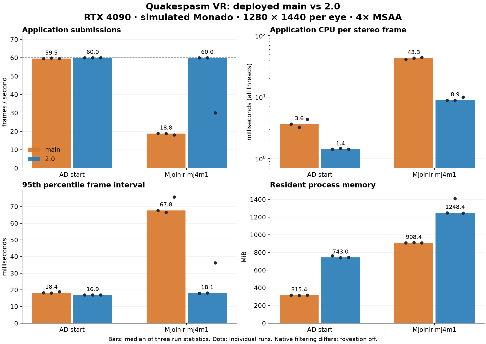

# VR performance: deployed main versus 2.0

2026-10-03. **2.0 performs better in these Linux simulated-headset tests, especially on Mjolnir's `mj4m1`.** AD reaches approximately the same 60 Hz cadence in both builds, while 2.0 consumes 61% less application CPU time per frame. On `mj4m1`, two 2.0 repeats reach approximately 60 submissions/s and one reaches 30.08, versus 18.83 frames/s for main's median; median CPU consumption per frame is 79% lower. **2.0 uses more resident process memory.**

This is an engine-plus-runtime comparison at the same resolution/MSAA, with native texture-filter variation; it is not pixel-identical rendering or a physical Beyond/Steam Frame benchmark. Main uses its deployed OpenVR/OpenGL binary through XRizer; 2.0 uses native OpenXR/Vulkan. No production engine changes were made for these measurements.



## Accepted measurements

Each cell is the median of three per-run statistics. CPU is the **whole application's accumulated CPU time across all threads per stereo frame**, not frame latency. FPS counts successful nonempty two-eye application submissions; it is not compositor-display or reprojection telemetry.

| Map | Build | Submitted frames/s | CPU median, ms/frame | Frame interval p95, ms | Process RSS median, MiB |
| --- | --- | ---: | ---: | ---: | ---: |
| AD start | main | 59.55 | 3.64 | 18.35 | 315 |
| AD start | 2.0 | 60.00 | 1.42 | 16.94 | 743 |
| mj4m1 | main | 18.83 | 43.31 | 67.79 | 908 |
| mj4m1 | 2.0 | 59.98 | 8.90 | 18.09 | 1248 |

Main's three `mj4m1` runs range from 18.10–18.92 frames/s, versus 30.08–60.00 for 2.0. AD main ranges 59.53–59.85, versus 60.00 in every 2.0 run. Counts and per-run statistics are in [runs.csv](benchmarks/2026-10-03-monado-vr/runs.csv); aggregates are in [summary.json](benchmarks/2026-10-03-monado-vr/summary.json).

Application wall time outside `xrWaitFrame`, including `xrEndFrame` and work before the next wait, has medians of **3.77 → 0.69 ms** on AD and **44.00 → 2.12 ms** on Mjolnir. This is neither isolated CPU execution nor GPU render latency. The cap masks additional throughput on AD: maintaining 60 submissions/s with less CPU work means more measured application headroom, not proof of a particular uncapped FPS. OpenXR deliberately paces frame submission through `xrWaitFrame`; see the [official frame-submission guide](https://github.com/KhronosGroup/OpenXR-Guide/blob/main/chapters/frame_submission.md).

## Why the results are plausible

The installed `mj4m1.bsp` is BSP2 with a **zero-length visibility lump**, 427,881 surfaces, and 160,333 leaves. The header was read directly and counts agree with the deployed main's diagnostics. Without compiled visibility data, the engine has much more candidate geometry to consider; frustum/backface culling still rejects surfaces. This does not mean everything is drawn.

Separate native main profiling identifies expensive surface marking, world rendering, and opaque-entity rendering. Those diagnostics are excluded from primary CPU results because they log extensively. The source references explain plausible advantages, rather than attributing the measured speedup to any single change:

- [2.0 render passes](../Quake/r_passes.c) use Vulkan multiview with a view mask of 3; [stereo shaders](../Shaders/stereo.inc) use the eye index. Stereo scene preparation and command recording can therefore serve both eyes.
- [Screen scheduling](../Quake/gl_screen.c) and [renderer tasks](../Quake/gl_rmain.c) retain vkQuake's parallel visibility, entities, particles and command preparation. Task rendering and indirect rendering were enabled in the sampled benchmark settings.
- [Brush rendering](../Quake/r_brush.c) and [world rendering](../Quake/r_world.c) retain Vulkan indirect batches and GPU lightmap updating. Stereo visibility conservatively includes both eye positions.
- The reference main `Quake/vr.c:10820` renders each eye sequentially. Its `Quake/r_world.c:1291,1476` already shares stereo visibility and supports batching; claiming it repeats *all* work twice would be wrong. The deployed main's exact binary/source pairing was not verified, so source-based explanations remain inference.

There was no ablation isolating multiview, tasks, indirect draws, visibility, or XRizer overhead. The measurements establish an advantage for the complete tested 2.0 configuration, not a universal Vulkan-over-OpenGL factor.

## GPU and visual effects

Native GPU timers were collected separately. Main's queries surround `R_RenderView` for each eye, excluding later MSAA resolve, gamma and adapter copies; their elapsed spans can also include GPU starvation while the CPU issues commands. 2.0's asynchronously read timestamps cover broader shared stereo render/compute/resolve work. Consequently **no apples-to-apples GPU speedup factor is established**. AD's diagnostics do not establish a GPU win for 2.0; its clear measured advantage is application CPU consumption and frame pacing.

Supplementary single-run checks, separate from the three-repeat baseline:

| 2.0 configuration | AD start | mj4m1 | Measured window |
| --- | ---: | ---: | --- |
| Native nearest filter, SSAO 1 / OIT 1 / RT shadows 2 | 60.00 submissions/s | 60.00 submissions/s | 45–90 seconds, each |
| Linear filter, 16× anisotropy, SSAO 1 / OIT 1 / RT shadows 2 | 60.00 submissions/s | Excluded: mixed cinematic/gameplay scene | AD 45–90 seconds |

The linear Mjolnir diagnostic's opening sequence lasted until 56.69 seconds; 116 of its 149 samples in the proposed 45–60-second window were still at the cinematic location. It is therefore excluded from comparative performance and GPU results. Its late 58–60-second samples corroborate the destination camera and actual viewing direction: median origin approximately [1756, −3945, −189], actual yaw 87.63–90.29°, overlapping main's diagnostic orientation envelope. This is a short geometry check, not a performance window. AD's linear/effects check establishes its observed 60 submissions/s with those settings. The supplementary results do not isolate filter/effect costs, guarantee stable cadence, or establish pixel-equivalent quality.

**Unresolved cadence issue:** the third primary 2.0 Mjolnir repeat delivered 30.08 submissions/s instead of 60. Its median application interval was 33.32 ms, CPU consumption 9.99 ms/frame, and wall time outside `xrWaitFrame` 18.90 ms. The median gap from `xrEndFrame` returning to the next `xrWaitFrame` was **17.64 ms**. The runtime still usually reported a 16.67 ms display period. The later linear/effects diagnostic also ran near 30 while mixing cinematic and gameplay scenes, so it provides no settled-view comparison. The data locate the delay in the frame cycle but do not establish whether its cause is application pacing, synchronization, window presentation, the runtime or desktop interference. This outlier is retained in every aggregate, CSV and chart. Two runs reaching 60 do **not** demonstrate reliably sustaining 60 in every run.


## Reproduction and qualification

Hardware: Ryzen 7 7800X3D (8 cores/16 threads), RTX 4090, Nvidia driver 615.71.09. Normal adaptive clocks, existing desktop applications and compositor remained running. No GPU clock locking, resets or system-runtime changes. Global GPU telemetry includes those other processes and is not isolated engine energy/VRAM usage.

Runtime: installed Monado `v25.1.0-847-g6b41c5b39`, private simulated HMD and two simulated WMR controllers, XCB compositor on the RTX 4090. Actual recommendation and submitted rectangles are **1280 × 1440 per eye**, two projection views, 60 Hz, common FOV, and 63 mm IPD. Requested higher Monado scale was clamped; this is **not Beyond-native resolution**. No gaze/foveation, network play, spatial audio, physical input, whole-map route or multiple avatars were benchmarked.

Shared settings: 4× engine MSAA, mirrors off, world scale 1, floor offset −16, viewsize 100, dynamic lighting on, classic particles 2, model/movement interpolation on. Primary 2.0 extras SSAO/ray-traced shadows/OIT/foveation are off. Main uses linear trilinear texture filtering; 2.0 retains its native nearest-filter default. Both use 16× anisotropy. Thus the repeated results do **not** claim equal graphics settings in every respect. `r_shadows 0` is an old-only cvar; 2.0 reports it unknown, and uses its explicitly disabled `r_rtshadows` instead. Post-resolve OpenXR swapchains are single-sampled; internal engine MSAA is 4×.

Each run is a fresh process using read-only symlinks to the same canonical content and private configs. Command family:

```text
<existing-binary> -basedir <private-game> -userdir <private-user> -game ad|mjolnir
  -window -width 640 -height 480 -condebug -nosound -nojoy -noudp
  -nosteamapi -heapsize 1048576 -vr| -openxr
```

Private `quake.rc` loads `map start` or `map mj4m1` explicitly; no user configs are executed. The 640×480 window is the desktop window, not the VR render resolution. Main uses the installed patched XRizer and `SDL_VIDEO_X11_FORCE_EGL=0`; mapped library receipts confirm the actual bridge and Monado/Nvidia backend.

AD: 30 seconds warm-up, 60-second capture, three interleaved pairs with order reversed for pair two. Mjolnir: **45 seconds warm-up, 60-second capture, three interleaved pairs**, after both opening sequences settle. Earlier 30–90-second Mjolnir runs are retained but excluded from the accepted comparison because the cinematic completes at different times. Signon/map names, final stereo origins, and orientation diagnostics support the same authored destination/view. Simulated head wobble has different phases; small camera-root differences remain, so the views are not exact pose replays.

A measurement-only OpenXR layer timestamps wait-to-wait frame cycles with monotonic wall and whole-process CPU clocks. Only successful `shouldRender` two-view cycles qualify. Main's settled runs additionally log actual GL world transforms through forwarding wrappers; 2.0's parent reads native camera/state once per second. This differential camera-observer overhead was not independently isolated. One AD timing-layer on/off calibration observed 1.527 versus 1.485 CPU ms/native frame (about 2.8% difference); this is one pair, not a correction factor or universal bound. Native profilers are off in all accepted primary runs.

Memory values include driver/runtime resident allocations, not just the Quake heap or GPU memory. Higher 2.0 RSS is an observed tradeoff; no leak or allocation cause was established. Startup/load time was excluded rather than benchmarked. All accepted runs exited normally after SIGTERM to their owned PID.

## Build and evidence identity

2.0: source `d5cfff6ce4cd5c36a75395aa02909f01093b4c51`, final existing Linux package, SHA-256 `3ffd3418f4c4706a1b05a1894ab97de222a6b077de37dd3806e0213976bcf3b2`. Later branch commits before this benchmark change documentation only.

Main: actual Straight `quakespasm-openvr.bin`, SHA-256 `468e62befe631f8c686083369c8d78c5d168c8aef90345ad53318ad4dfd0532e`, ELF build ID `a6dc8ae5f4dbe9374c41503c528e2cd9faf95376`. It was not rebuilt from the reference checkout.

Local complete receipts, per-frame timings, sampled settings, input hashes, profiles and private runner/layer sources: `/home/obesecatlord/FastGames/qsvr-vr-benchmark-vtg9cct7`. `content-hashes.json` identifies the canonical AD PAK/start BSP and Mjolnir BSP/lit. Main code and Straight assets/configs were not modified. Failed early runtime/menu pilots are retained and excluded.

Local Astra/xhigh method review caught the cinematic/camera issue and required fresh settled runs. It also required explicit GPU timer scopes, full-process CPU accounting, actual resolution and nonempty stereo receipts. A final result disposition is retained with the local evidence.


## Senior-review disposition

Astra's effective reviewer settings were verified as `gpt-6-astra`, `xhigh`. The main agent independently checked the load-bearing data below.

| Recommendation | Disposition |
| --- | --- |
| Exclude cinematic-overlapping primary Mj windows | Adopted: fresh three-pair 45–105-second measurement; all 180 sampled 2.0 origins are at the destination. |
| Preserve the 30 FPS primary outlier prominently | Adopted: retained in table aggregates, range, plot and CSV; its 17.64 ms post-submission gap is reported without an invented cause. |
| Exclude mixed-scene linear/effects Mj diagnostic | Adopted: 116/149 proposed-window samples remain in the cinematic; no settled-view performance or GPU claim is made from it. |
| Distinguish GPU timer scopes and cumulative CPU time | Adopted: no isolated GPU factor or CPU-time-as-latency claim. |
| Disclose filtering, observer, memory and simulated-pose limits | Adopted: qualified configuration comparison; no headset-native or pixel-identical claim. |
