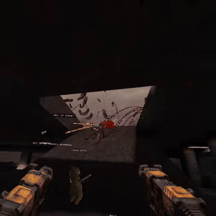
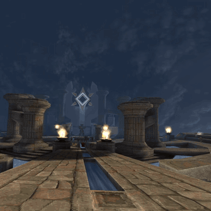

# Quakespasm VR

Quakespasm VR is a [vkQuake](https://github.com/Novum/vkQuake) fork focused on VR
play, mod compatibility, and multiplayer.

  
  

## Features

- OpenXR head and controller tracking with Vulkan single-pass stereo rendering.
- vkQuake graphics and multithreaded rendering/loading, with configurable
  lighting, shadows, ambient occlusion, MSAA, and texture filtering.
- Predictive ntcode
- A weapon wheel for VR, mouse, and gamepad play, with co-op respawn and teleport
  options
- Built-in VR weapon offsets for popular mods
- VRIK and support for custom avatars via .vrm support
- VOIP and spatialized audio
- Windows, Linux, and Steam Frame support
- Mod downloader/browser

## Installation

Download your platform's archive from [Releases](https://github.com/ObeseCatLord/Quakespasm-VR/releases)
Extract it

## Co-op Features

Streamlined co-op is enabled by default, which include respawning ammo,
no friendly fire, shared keys, and the ability to teleport on other players.
Set `sv_coop_classic 1` on the server

### VR controllers

| Input | Action |
| --- | --- |
| Left stick | Move |
| Right stick left/right | Snap or smooth turn |
| Right stick click; Index right touchpad touch | Weapon wheel |
| Left trigger | Jump |
| Right trigger | Attack; point and select in menus |
| Left stick click | Run/walk modifier |
| Left application/menu button | Main menu |
| Right application/menu button | Next weapon |
| Left A button; left grip | Show scores |
| Right A button | Previous weapon |
| Right grip; Index right stick click | Use / alternate fire |
